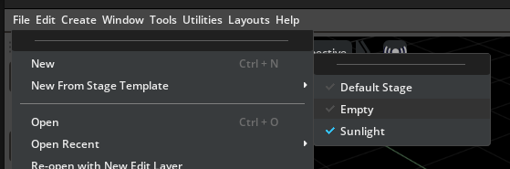
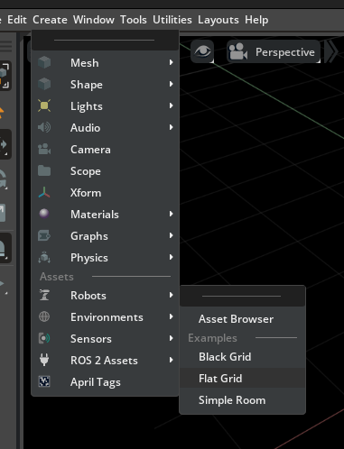
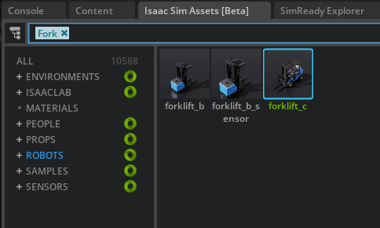

# IsaacSim_Doc
Following IsaacSim Official Documentation

# 87- ROS 2 Ackermann Controller

## Prepare your stage:

Create an Empty Stage

Create a Flat grid

Import a Forjklift_c

Follow the steps in the order
🔗 [ForkLift Ackerman Controller Tutorial](https://github.com/DreamCodes4Life/IsaacSim_Doc/tree/main/ROS2/FORKLIFT_ACKERMAN_ROS2)

🔗 [NVIDIA Docs tutorial reference](https://docs.isaacsim.omniverse.nvidia.com/5.1.0/ros2_tutorials/tutorial_ros2_ackermann_controller.html)

# 163- Mapping (Occupancy Map)

1- Create a physical Scene

2- Make sure you have the Extension isaacsim.asset.gen.omap

3- Tools -> Robotics -> Occupancy Map

4- Make sure you dont have colliders in the Origin position 

Extension@:

<video controls src="Videos/OccupancyMap_Scrip.mp4" title="Title"></video>
